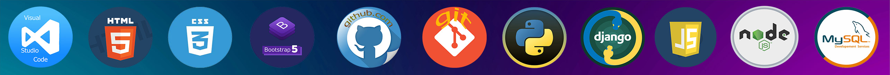
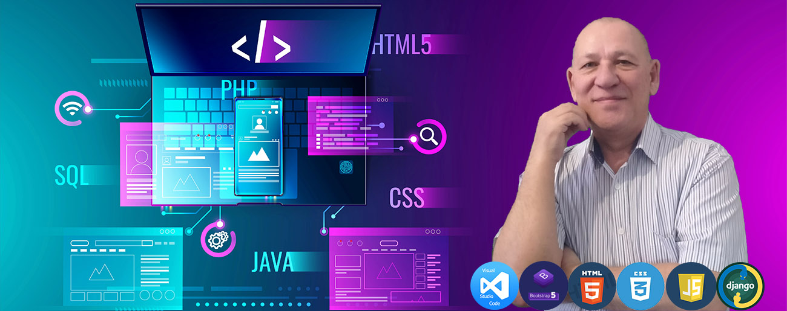

# 
# Привет❗
## 🧔Меня зовут Валерий.
## Я junior frontend разработчик с дальнешим обучением до full stack
## Работаю с PSD, Figma и другими макетами сайтов.  Мои инструменты:   

<ul style="list-style-type:none"> 
 
    <li>✔️среда разработки VS studio </li>
    <li>✔️HTML </li>
    <li>✔️CSS</li>
    <li>✔️Bootstrap</li>
    <li>✔️JavaScript</li>
    <li>✔️Python</li>  
    <li>✔️Django</li>
    <li>✔️git+github</li>
    
</ul>
Готовлю материалы для сайта:
<ul style="list-style-type:none"> 
    <li> 📽️Изготавливаю видеоролики с нуля на любые темы</li>
    <li> 📈Работаю в графических редакторах</li>
    <li> 📜Тексты, копирайтинг</li>
</ul>

#### Часть выполненных мной проектов находятся здесь в репозиториях.
#### Некоторые страницы адаптированы под все устройства, некоторые -нет. 
#### Изначально такой цели перед собой не ставил, а теперь каждый новый проект обязательно адаптирую.
#### Буду рад любму совету, поделюсь своими знаниями
#### Сейчас работаю над проектом: [jeep-service](https://jeep-service.github.io/)

#### Связаться со мной можно: 
####  +79061950283, @bikwal, , bikwal
### :fire: My Stats :

